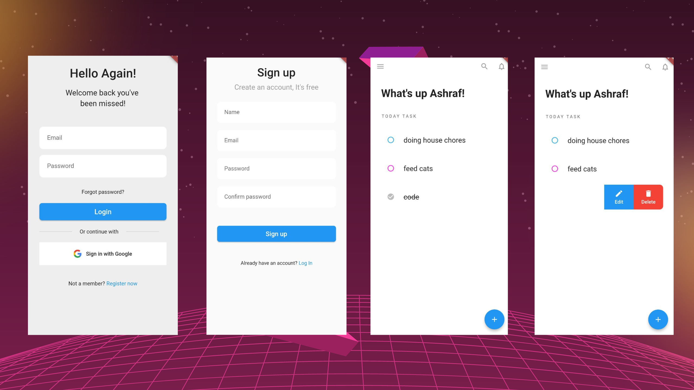

# Todo app

This app is just basic todo app that **can perform crud**. I build this app is for internship's preparation. When I build this project, I faced so many challenge and also learn more about flutter and laravel. I'm shock because laravel has everything for us and it's so magic :boom: . I also add **authentication** in this app.

### Technologies used

- Flutter
- Laravel

### Overview

### How to install & run this project

1.  `git pull https://github.com/thrashraf/todo-flutter---laravel.git`
2.  open this folder in your favourite IDE
3.  open terminal
4.  to run flutter, execute this command `cd flutter/` and `flutter run`. make sure you already install flutter on your machine 😉
5.  to start the server, `cd backend/` and `php artisan serve`. if you using scrcpy real device to execute flutter, run this command `php artisan serve --host 0.0.0.0`. and replace your IP Address to make request.

### Features I hope to implement in the future.

1. Add google authentication.
2. Add reminder and push notification.
